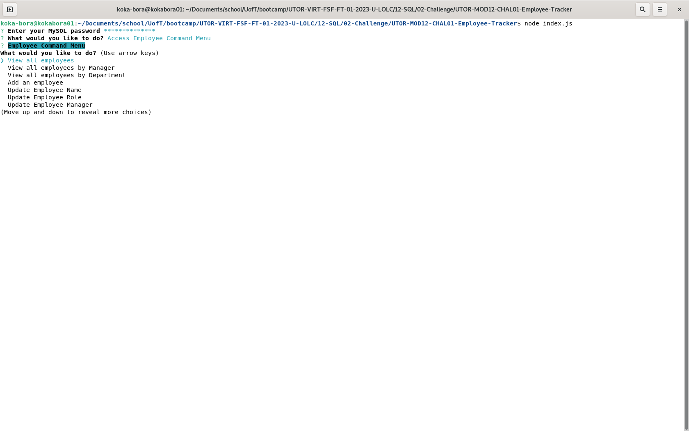

# UTOR-MOD12-CHAL01-Employee-Tracker
University of Toronto - Module 12 - Challenge 01 - Employee Tracker

## Description

Repository containing the code for the Employee Tracker application. This is a server side project using node.js where the user is asked a series of questions and based on user's answers, the MySQL database behind the scenes is updated. The application revolves around three aspects and the command line menus are grouped into the following:
- Departments: the application allows the user to 
    - add a new departments
    - update an existing department
    - delete an existing department
    - view existing departments
    - view budget per department (total of all employee salaries within the department)
- Roles: the application allows the user to
    - add a new role
    - update an existing role
        - update to role title
        - update to salary
    - delete an existing role
    - view roles, salaries, and departments to which the roles are linked
- Employees: the application allows the user to
    - add a new employess
    - update an existing employess
        - update to employee's name
        - update to employee's role
        - update to employee's manager
    - view employees
        - grouped by their id
        - grouped by their manager
        - grouped by their department

The application runs in a continuous loop until the user decides to "exit application" by selecting it from the menu. The user can choose to go back and forth between the various menus and execute commands from those menus. 

In addition, the user is asked to enter their correct MySQL credentials prior to continuing with the aplication. Otherwise, the user will be asked again.

Below is the image of the application


Below is the image of the application after the user has selected to view data from the database


## Table of Contents

- [Installation](#installation)
- [Functionality](#functionality)
- [Usage](#usage)
- [Credits](#credits)
- [License](#license)

## Installation

PRE-Requisites: 
- you must have node.js version 16.* installed on your computer prior to proceeding
- you must have MySQL/MariaDB installed on your computer prior to proceeding

### Databse setup
This must be executed before launching the application
1. Log into your MySQL/MariaDB server.
2. Execute in the order provided:
```md
    mysql> source path_to_schema.sql/schema.sql
    mysql> source path_to_seeds.sql/seeds.sql
```
3. Verify the database initialization checking the console to see the output of the three tables.

### Application launch:
1. Download the source code
2. Navigate to the folder containing the package.json file
3. Run npm install
```md
        $ npm install
```


## Functionality

The following discusses at a high level about some of the features of the website. Detailed code implementation can be found as comments in the JS files.


### Node.js:

The entire porject is built on Node.js utilizing the following additional libraries:
- inquirer: to manage user input. Several prompts are used to gather input from the user. Some of the prompts are also shown/hidden based on conditions. For example, the list of employees is only shown when the user has to select specific employee to eiher update or delete. Validaton of the salaries takes place in the command line to prevent bad input from being entering the program 
- mysql2: this librabry handles all communication between the application and the database. Prepared statements are used for the all database operations requiring input.
- console.table: this is the library used to provide database info into a formatted text to show to the user. The JSON response from the mysql2 queries are turned into columnar data using this library.


### Command Line:

This is a command line application where user input can be questionable. As such there are a few items to be aware of:
- The application does not check for whether the user input is pertaining to the section as opposed to random keystrokes. This is particularly true in case of names/department/roles.
- Pressing the Enter (or Return) key does not cause a new line, but end of input. So there are cases where the use input is truncated. 

Aside from that, the command line is set up in a series of menus that the user can navigate to and from. The user can quit by clicking the "Exit Application" menu option which is available at all menus.


## Usage

For accessing the application:<br>

1. using your command prompt navigate to the application
2. Run npm start 
```md
        $ npm start
```
3. Provide your MySQL credentials
4. Go through the menus and answer any prompt inputs as necessary


## Credits
- Android Web Devloper codelabs for the introduction to Singleton pattern to prevent having multiple instances of the same class being used inside the application. This is necessary in particular for database operations to prevent users to perform multiple operations at once. 

- STackoverflow for the way to implement the Singleton patter in JavaScript 

## Tests

All tests have been performed manually as the application requires user input.


## License

Please refer to the LICENSE in the repo.


## Walkthrough

- Application walkthrough: TBD 


## Future Development

Here are some of the items to be considered for future development.
1. Add "cancel" option to stop the user from updating or deleting a particular item
2. Remove the selected employee from the list of "managers". When updating an employee manager, the user can select the same employee. 

